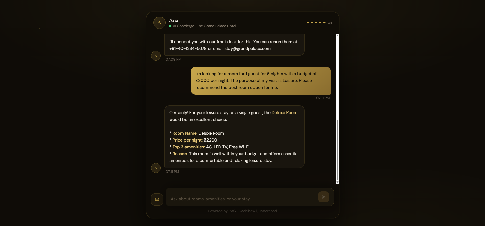
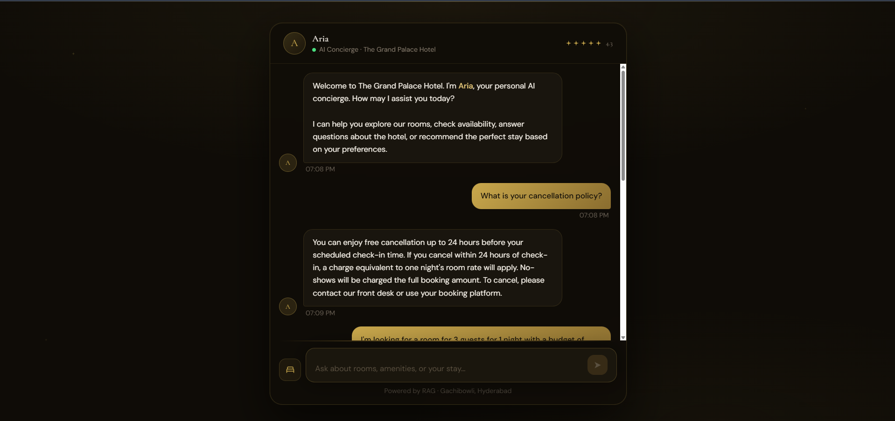
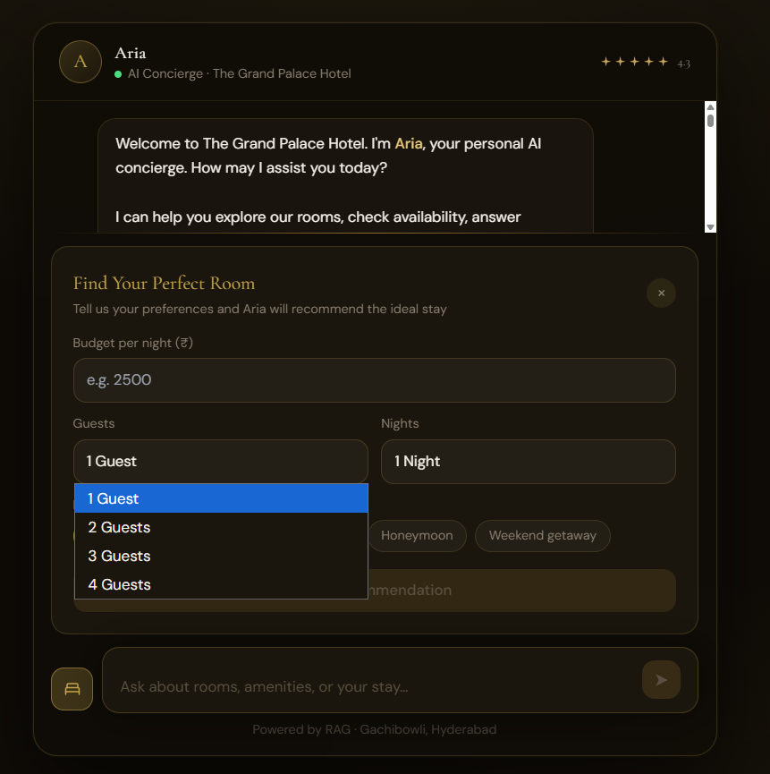

# Aria - Hotel AI Assistant

Aria is a small hotel concierge web app built with React, Vite, Tailwind CSS, and an n8n RAG workflow. It lets a guest ask normal hotel questions, check policies, and request room recommendations from a simple form.

The project is intentionally practical: the frontend is a clean chat interface, while n8n handles the AI agent, memory, and knowledge-base lookup behind a webhook.

## Screenshots

### Room Recommendation



### Hotel Policy Chat



### Recommendation Form



## What It Does

- Answers hotel questions through an n8n webhook.
- Uses a RAG workflow so responses come from the hotel knowledge base.
- Supports chat memory with a browser session ID.
- Includes a room recommendation form for budget, guests, nights, and visit purpose.
- Provides quick prompts for common hotel questions.
- Normalizes n8n responses from `reply`, `output`, or `text`, so the frontend can work with common n8n agent outputs.

## Tech Stack

| Layer | Tool |
| --- | --- |
| Frontend | React 18, Vite |
| Styling | Tailwind CSS and custom CSS |
| Workflow backend | n8n webhook workflow |
| AI agent | n8n AI Agent with Gemini chat model |
| Retrieval | Supabase Vector Store |
| Embeddings | Gemini embeddings |
| Memory | Postgres Chat Memory |
| Knowledge source | Google Sheets, seeded into Supabase |

## How The App Talks To n8n

The frontend sends a POST request to the webhook URL configured in `.env`:

```json
{
  "message": "What is your cancellation policy?",
  "sessionId": "sess_example123"
}
```

The n8n workflow returns an assistant response. Depending on the workflow version, the field may be `reply` or `output`; the frontend accepts both.

Expected response shape:

```json
{
  "reply": "You can enjoy free cancellation up to 24 hours before your scheduled check-in time.",
  "sessionId": "sess_example123",
  "timestamp": "2026-05-29T13:40:00.000Z"
}
```

The current app also handles this n8n agent-style response:

```json
{
  "output": "You can enjoy free cancellation up to 24 hours before your scheduled check-in time."
}
```

## n8n Workflow

This repo includes a sanitized n8n workflow template:

```text
Hotel AI Assistant - Webhook RAG Agent.sanitized-template.json
```

Use this file when sharing or importing a clean version of the workflow. It does not include credential IDs, account names, workflow IDs, instance metadata, or private Google Sheet links.

The workflow used by this project follows this path:

```text
Webhook
  -> AI Agent
      -> Gemini chat model
      -> Postgres chat memory
      -> Supabase knowledge-base tool
  -> Format Response
  -> Webhook returns the last node output
```

There is also a working local n8n export that uses the last-node response approach:

```text
Hotel AI Assistant - Webhook RAG Agent.last-node-fixed.json
```

That version avoids manual JSON inside a `Respond to Webhook` node. The AI output is formatted in a separate node, then returned as the final webhook response.

Before using the sanitized template, reconnect these credentials in n8n:

- Google Gemini API credentials
- Supabase API credentials
- Supabase/Postgres memory credentials
- Google Sheets credentials for knowledge-base seeding

Also replace the placeholder Google Sheet values:

```text
REPLACE_WITH_GOOGLE_SHEET_ID
REPLACE_WITH_SHEET_NAME_OR_GID
REPLACE_WITH_TAB_NAME
```

## Local Setup

Install dependencies:

```bash
npm install
```

Create an environment file:

```bash
cp env.example .env
```

Set your n8n webhook URL:

```text
VITE_N8N_WEBHOOK_URL=https://your-n8n-host/webhook/chat
```

Run the app:

```bash
npm run dev
```

Open the local Vite URL, usually:

```text
http://localhost:5173
```

Build for production:

```bash
npm run build
```

## Project Structure

This project uses a flat Vite structure rather than a `src` folder.

```text
ChatbotRAG/
  App.jsx
  main.jsx
  api.js
  useChat.js
  ChatWindow.jsx
  MessageBubble.jsx
  ChatInput.jsx
  QuickSuggestions.jsx
  RecommendForm.jsx
  TypingIndicator.jsx
  index.css
  index.html
  tailwind.config.js
  vite.config.js
  assets/readme/
  Hotel AI Assistant - Webhook RAG Agent.sanitized-template.json
```

## Notes

This was built as a focused RAG chatbot for a hotel setting, not as a generic chatbot shell. The UI is designed around a guest conversation: policies, rooms, amenities, nearby attractions, and recommendation requests.

The n8n workflow is the important backend piece. It receives the guest message, passes it to an AI agent, lets the agent retrieve hotel facts from Supabase, keeps conversation context with Postgres memory, and sends the result back to the React app.
